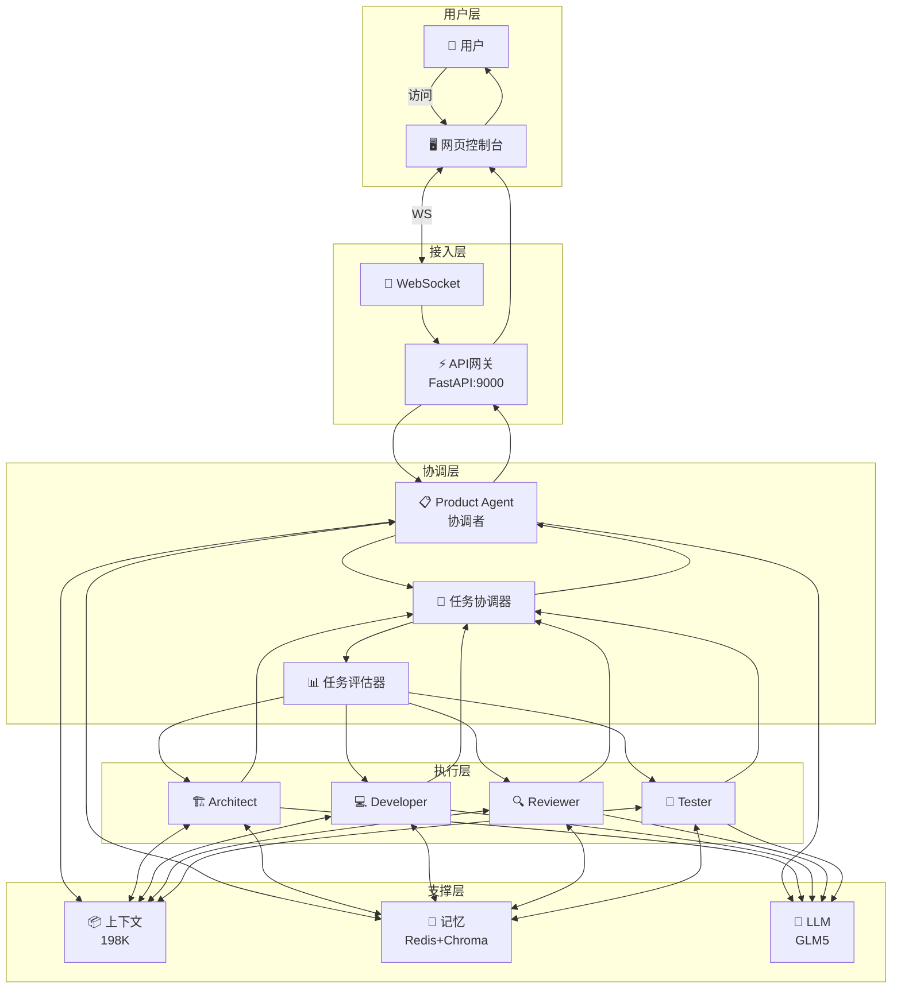
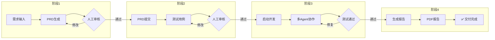
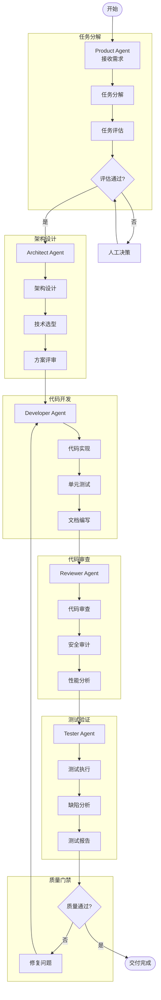
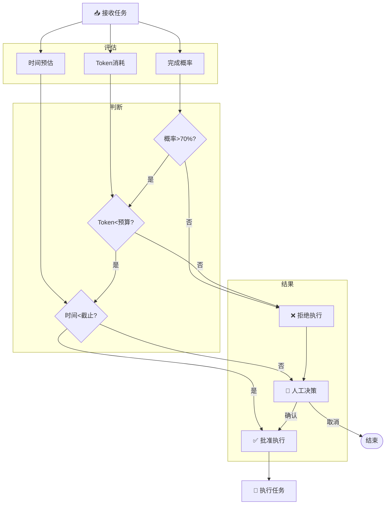
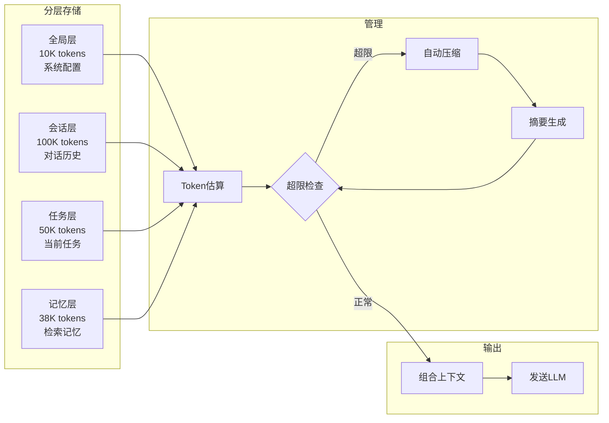
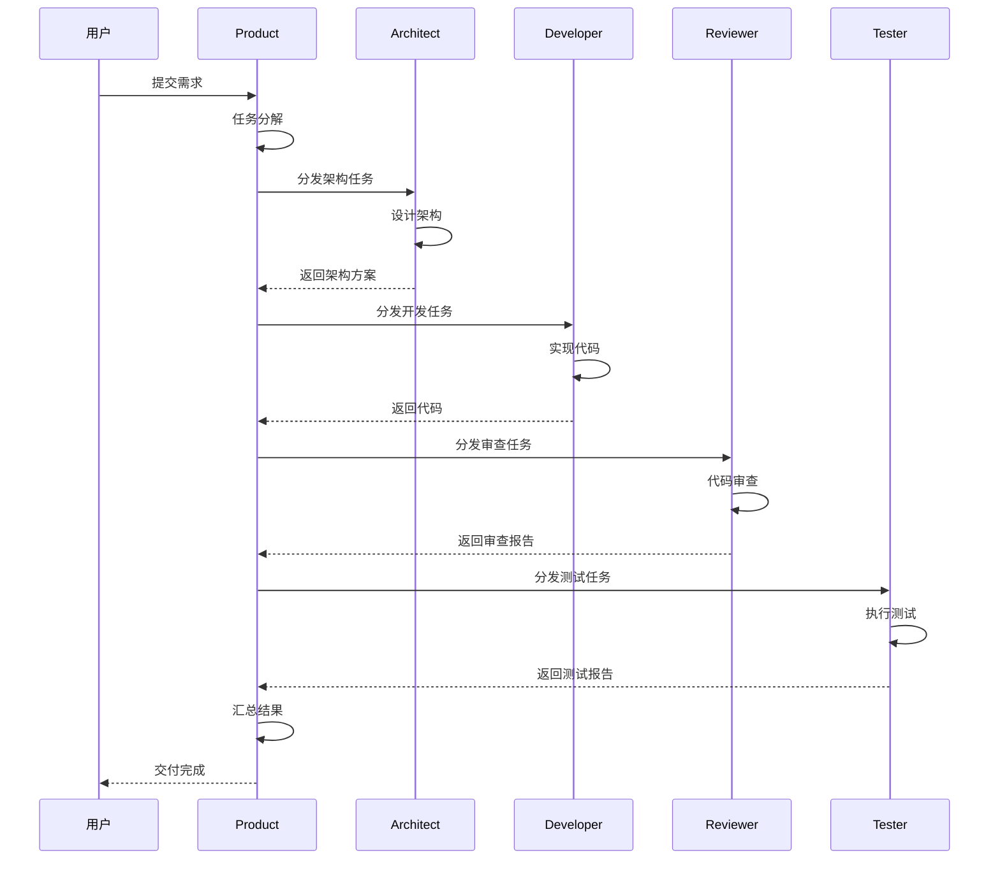
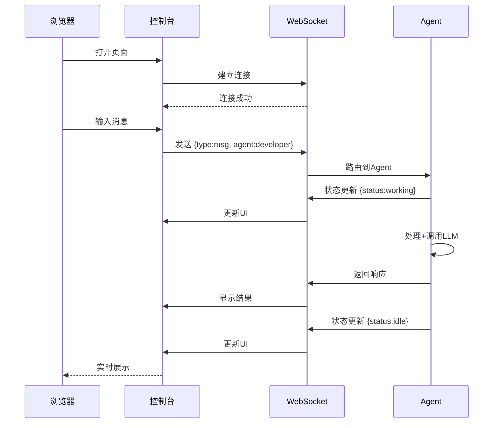
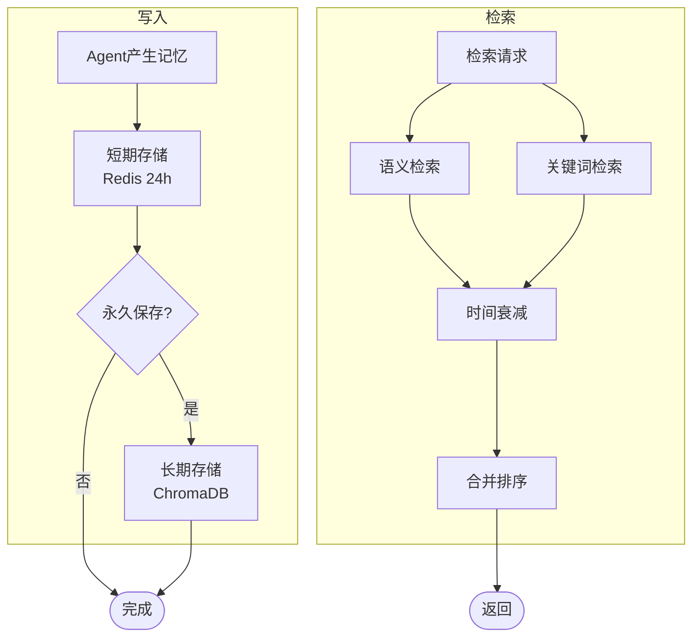
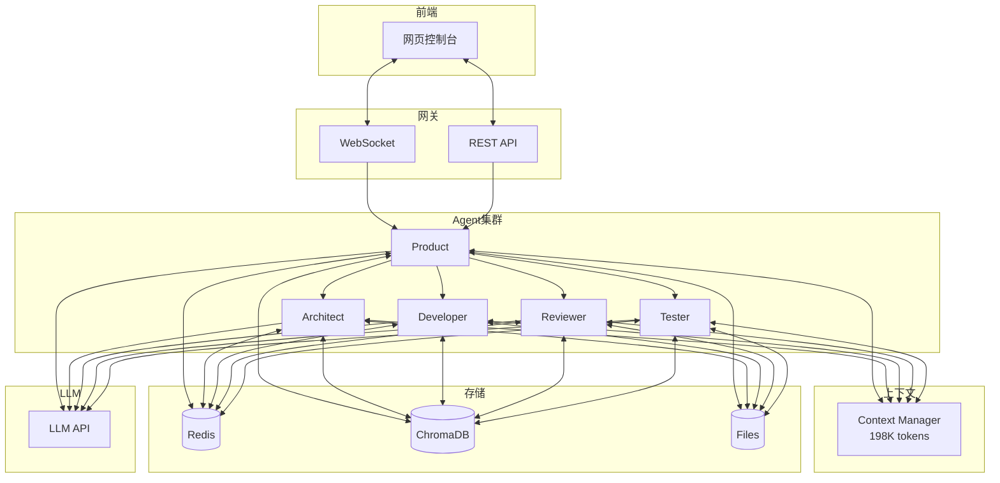
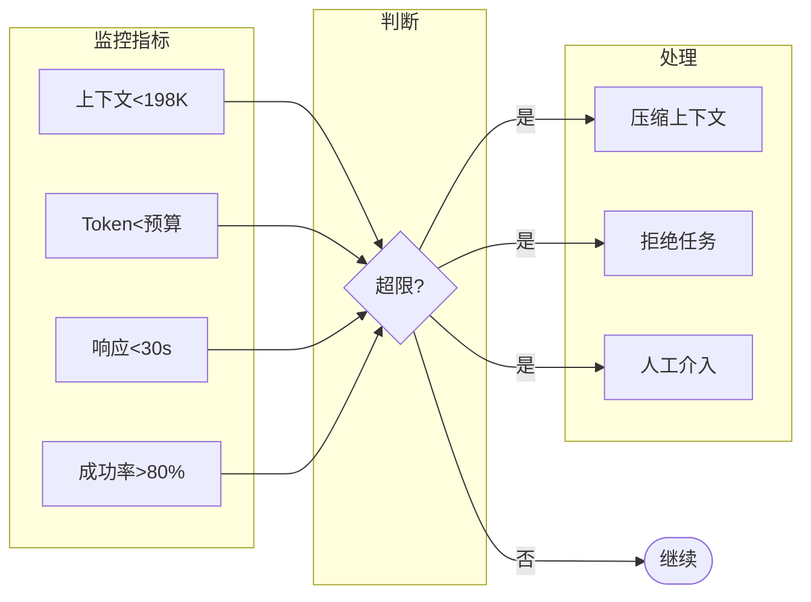

# 任务001 - 多Agent协作系统业务流程图

## 1. 整体架构流程

---

## 2. 四阶段交付流程

---

## 3. 多Agent协作开发流程

---

## 4. 任务评估决策流程

---

## 5. 上下文管理流程

---

## 6. Agent消息流转时序

---

## 7. 网页控制台交互流程

---

## 8. 记忆管理流程

---

## 9. 数据流架构

---

## 10. 质量监控流程

---

## 流程图说明

| 图表 | 说明 |
|------|------|
| 整体架构流程 | 系统各层组件交互关系 |
| 四阶段交付流程 | PRD→测试用例→开发→报告 |
| 多Agent协作流程 | 5个Agent协作开发完整流程 |
| 任务评估决策 | 自动评估+人工决策机制 |
| 上下文管理 | 198K分层管理+自动压缩 |
| Agent消息流转 | Agent间任务分发时序 |
| 网页控制台交互 | WebSocket实时通信 |
| 记忆管理 | 短期+长期记忆读写 |
| 数据流架构 | 完整数据流转路径 |
| 质量监控 | 关键指标监控告警 |

---

**所有流程图支持Mermaid渲染**（GitHub、Typora、VS Code等）
